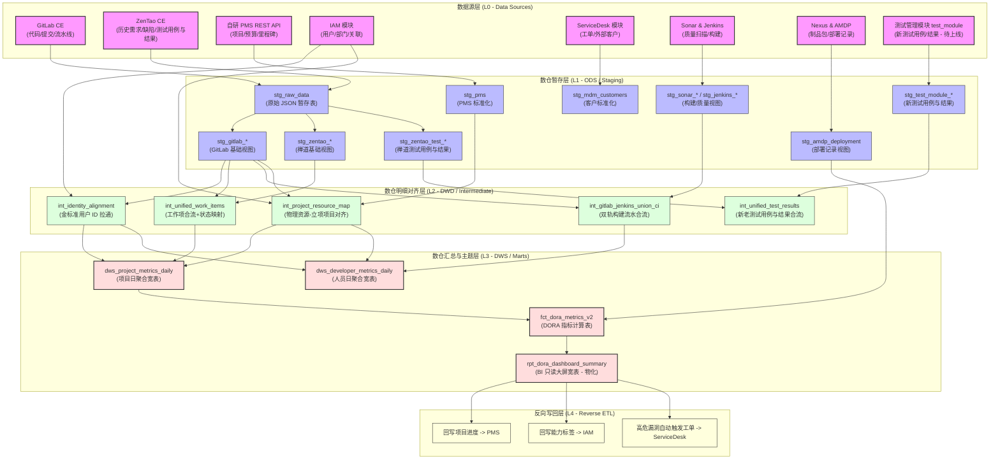

# DevOps 数据中台建设实施计划 (双轨测试质量保障版)

本计划已整合 **主数据管理 (MDM)** 与 **数据仓库 (DWH)** 的最佳实践，特别针对**新测试管理模块未上线、禅道中存有历史测试数据且需要抽取**的业务现状，设计了测试数据的双轨并流方案与专项数据质量保障机制。

______________________________________________________________________

## 一、 全景数据流向与血缘 (Data Flow & Lineage)

中台采用 **ELT 架构**，数据流向从源系统到数仓分层，最终通过反向 ETL 回写形成闭环。整体流向与血缘脉络如下：

### 血缘与解析说明：

1. **测试数据源双轨合流**：
   - 老数据从 `stg_zentao_test_*` 提取，新数据（待上线）从 `stg_test_module_*` 提取。
   - 在数仓明细对齐层创建统一模型 `int_unified_test_results.sql`，执行 `UNION ALL` 联合对齐，确保大屏可穿透查看历史测试覆盖率与用例执行质量。

______________________________________________________________________

## 二、 测试数据专项质量保障机制

为了保证测试数据从老系统（禅道）平滑过渡到新系统（测试管理模块），我们在数据中台配置了三项测试数据专项质量保证策略：

1. **用例与执行结果级联关联测试 (Orphan Result Prevention)**：
   - *规则*：测试执行结果必须有明确对应的测试用例（防止无源头的通过率/失败率统计）。
   - *实现*：在 dbt 的 schema 测试中配置 `relationships`。校验 `stg_zentao_test_results.case_id` 必须能在 `stg_zentao_test_cases` 中找到；对于新模块同样校验 `stg_test_module_results.case_id`。
   - *脏数据处理*：无法匹配用例的测试执行结果（孤儿数据）会被 intermediate 过滤并打上“异常数据”标签，避免拉偏产品总通过率。
1. **测试执行状态机归一化 (Status Normalization)**：
   - *规则*：禅道测试结果的状态（如 `pass`, `fail`, `blocked`）与新测试模块的执行状态，必须归一化。
   - *实现*：在 `int_unified_test_results.sql` 中使用 `CASE WHEN` 转换为中台标准测试状态：
     - `pass` / `passed` $\\to$ `PASSED` (通过)
     - `fail` / `failed` $\\to$ `FAILED` (失败)
     - `blocked` $\\to$ `BLOCKED` (受阻)
     - `skipped` $\\to$ `SKIPPED` (跳过)
1. **产品线与项目归因覆盖测试 (Product Line Routing Check)**：
   - *规则*：所有测试用例必须能够归属到具体的产品线 (`product_id`)。
   - *实现*：通过 dbt 的关系校验测试，检查是否有测试用例的 `product_id` 无法映射到标准 `mdm_products`。
   - *监控*：所有未成功归因到产品线的测试用例与执行结果，会计入数据质量审计指标 `unmapped_test_cases_ratio`，当此比例超过 5% 时，熔断调度器并进行微信报警。

______________________________________________________________________

## 三、 所有采集插件与系统模块对齐

### 1. 采集插件列表 (`devops_collector/plugins/`)

| 插件名称 | 状态 | 采集方式 | 目标系统 | 说明 |
|:---|:---|:---|:---|:---|
| **`gitlab`** | [KEEP] 保留并优化 | REST API + Webhook | GitLab CE 社区版 | 采集 Commits, Branches, Pipelines, Jobs, MergeRequests |
| **`zentao`** | [KEEP] 过渡保留 | REST API | 禅道社区版 | 采集历史缺陷、需求，**以及老测试用例 (`zentao_test_cases`) 与执行结果 (`zentao_test_results`)** |
| **`sonar`** | [KEEP] 保留 | REST API | SonarQube 社区版 | 采集代码扫描指标（圈复杂度、漏洞数、重复率） |
| **`jenkins`** | [KEEP] 保留 | REST API | Jenkins 服务群 | 采集 CI/CD 构建历史及构建产物信息 |
| **`nexus`** | [KEEP] 保留 | REST API | Nexus 社区版 | 采集依赖制品组件的包属性及制品快照，与 AMDP 协同 |
| **`pms`** | [NEW] 新增 | **HTTP REST API** | 自研项目管理系统 | 采集立项项目、项目预算、里程碑计划数据 |

### 2. 对接的已重构/新建模块

1. **测试管理模块 (`test_module` - 待上线)**
   - *表*：`test_cases` (测试用例), `test_executions` (测试执行), `test_results` (执行结果)。
   - *状态*：**尚未上线**。上线前中台从 `zentao` 抽取历史测试用例和执行数据；上线后作为主事实源，在数仓 `int_unified_test_results` 中执行双轨合流与过渡。
1. **IAM 身份系统 (在 AMDP 项目中)**
   - *表*：`identity_user` (用户, 主键 `global_user_id` CHAR(32)), `identity_department` (部门), `identity_mapping` (账号映射)。
1. **敏捷项目管理模块 (基于 GitLab CE 敏捷二开)**
   - *表*：`agile_product_mappings` (产品路由映射，主键 UUID v7), `mdm_epics` (史诗需求)。
1. **ServiceDesk (服务台) 模块 (基于 GitLab CE 二开)**
   - *表*：`sd_tickets` (工单，主键 UUID v7), `sd_customer_identities` (外部客户，主键 UUID v7)。
1. **BI 模块**
   - *接口层*：FastAPI 的 `/bi/metrics` 路由。
   - *作用*：通过 `TTLCache` 进行内存防穿透，直接将 DORA 等 marts 预聚合宽表通过 JSON 直吐 Vue3 大屏，遵循大屏可见性暂停和 ECharts 自动销毁规范。
